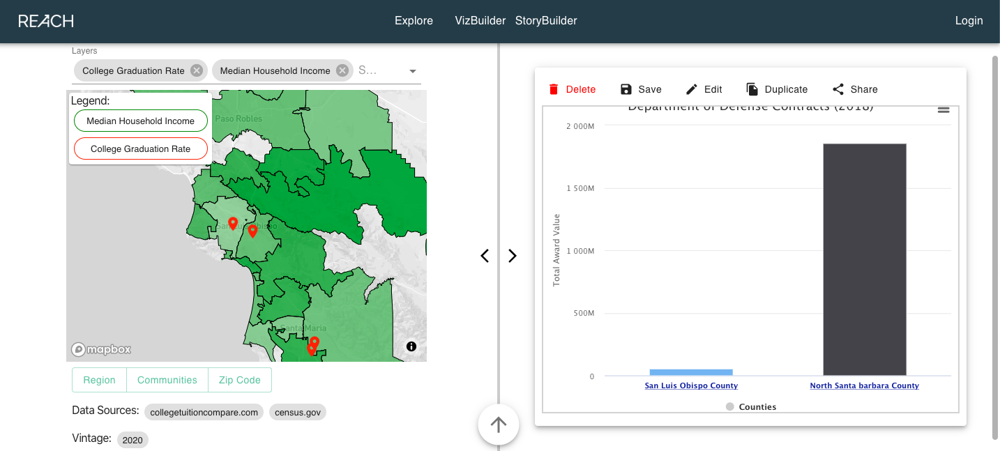

### User Guide

#### 1.0 Introduction
This User Guide will provide information on how to navigate the website.  This section will go into detail on creating an account, logging in, and the three main features of our site: the Explore Page, the VizBuilder page, and the StoryBuilder page.  For more information and guidance on how to use the site, please see the 'Demo' section of the site.

#### 2.0 User Accounts
The Reach site can be used without creating an account; however to save any maps, graphs, or stories a user account must be created to persist that data.

WARNING: Please do not use passwords that you would use on other sites.  We are still working on encryption and the overall security of our site.

##### 2.1 Creating an Account
1. To create an account, click the ‘Login’ button in the upper right hand corner and then navigate to 'Create Account' in the upper right hand corner.  
2. There are three options to create an account: through Facebook, Google, or by creating a Reach account by entering your name, email, and password.  
3. Once your account is created, you will be automatically logged in, which is indicated by the user icon appearing in the upper right hand corner.

##### 2.2 Logging in
1. If you already have an account and would like to log in, click the 'Login' button in the upper right hand corner, which will navigate you to our Login page.
2. Log in using whichever method you chose when creating your account.
3. Once you log in, this will be indicated by the user icon in the upper right hand corner.

##### 2.3 Logging out
1. To log out, click the user icon in the upper right hand corner, which will open up a dropdown menu.
2. Click 'Logout' at the bottom of the dropdown menu.
3. Once you are logged out, this will be indicated by the ‘Login’ button reappearing in the upper right hand corner.

#### 3.0 Explore Page
The Explore page is a way for users to view stories built by others using the StoryBuilder (see section 5.0).  These stories can be shared to social media or saved to your personal device.  The search bar at the top of the page will be used to search for relevant stories.  This page is still under construction and is not yet fully functional.

1. Click on 'Explore' on the navigation bar.
2. To view any stories on this page, click on the story card, which will navigate you to a new page with the full story. (not yet fully functional)
3. To share this story, click the 'Share' button, which will provide options to share to Facebook, Twitter, or LinkedIn.

#### 4.0 VizBuilder Page
The VizBuilder Page is a tool that allows users to dig deeper into Central Coast public data. From this page, the user can select to see the data as interactive graphs or as interactive maps or both. Users can specifiy custom filters and then view the resulting data as a series of visualizations based on their selections.

##### 4.1 Graphs
Once a user accesses the web application, a screen will appear with predefined graphs. A user can work with this graph or click on the upward arrow at the botton of the page to select new graphs from the five different initiatives available. 
The user will be able to see different types of graphs including: 

. a Line graph.

Line graphs are used to track changes over short and long periods of time. When smaller changes exist, line graphs are better to use than bar graphs. Line graphs can also be used to compare changes over the same period of time for more than one group.

. a Pie Chart.

Pie charts are best to use when you are trying to compare parts of a whole. They do not show changes over time.

. a Bar Graph.

Bar graphs are used to compare things between different groups or to track changes over time. However, when trying to measure change over time, bar graphs are best when the changes are larger.

. an Area Graph.

Area graphs are very similar to line graphs. They can be used to track changes over time for one or more groups. Area graphs are good to use when you are tracking the changes in two or more related groups that make up one whole category (for example public and private groups).

.  an X-Y Plot.

X-Y plots are used to determine relationships between the two different things. The x-axis is used to measure one event (or variable) and the y-axis is used to measure the other. If both variables increase at the same time, they have a positive relationship. If one variable decreases while the other increases, they have a negative relationship. Sometimes the variables don't follow any pattern and have no relationship.

A user will be able to delete, save, duplicate, or share a graph on Facebook, Twitter or LinkedIn by clicking on the specific buttons from the menu above the graph.

A user will also be able to print or download a graph as 'PDF', 'PNG', or 'JPEG' files. To do so, the user can click on the 3 lines icon in top right corner of the graph. 

A user can zoom in a graph for better readability; with a mouse pointer, the zooming is performed by dragging out a rectangle in the chart. The user can press the shift key and drag the mouse in order to move inside the zoomed in chart.

##### 4.2 Maps Overview
###### 4.2.0 Adding Layer to Map 
1. Click 'Layers' 
2. Select up to two data topics that you would like to view geographically. Depending on the type of data selected, the map will display pins or a choropleth map. 
3. For a choropleth map, hover the cursor over the map to find the values of a particular area.
4. For a pin, click on a pin to find the values at that point. 

###### 4.2.1 Adjusting Map Bounds (not yet implemented)
Click on 'Region', 'Communities', or 'Zip Code' to adjust the boundaries and data displayed on the map. 

#### 5.0 StoryBuilder Page
The StoryBuilder page is a tool to build a compelling and meaningful story using maps, graphs, images, and text.  This allows you to create a story with the visualizations created using the VizBuilder (section 4.0). These stories can then be saved and shared.

##### 5.1 StoryBuilder Overview
1. Click on 'StoryBuilder' in the navigation bar.
2. Fill in the title and description of the story you are trying to tell.
3. From here, you can add maps, graphs, images, or text to your story, using the toolbar on the left. (Only text blocks are implemented so far. Graph blocks are currently under development, and maps and images are coming soon.)
4. All of these components can be reordered by using the drag handles on the left side of each component.
5. To preview what the document will look like, click the 'Preview' button on the toolbar.
6. To save the document when it is finished, click the ‘Save’ button on the toolbar. (not yet fully implemented)

##### 5.2 Adding text to Story
1. Click 'Text' on left-hand side toolbar.
2. Click inside the box to type.
3. To use any of the stylings at the top of the text box, highlight the portion of the text and click on the styling wanted.

#### 6.0 My Stuff Page

##### 6.1 My Stuff Page Overview
The My Stuff page is a page for users with a REACH account can access their saved and bookmarked stories, maps, and charts. The page contains an overview, along with filters for maps, charts, and graphs so that users can view their saved collections. As of now, stories and charts have been implemented to save in the My Stuff page. Saving or bookmarking maps is under construction. 
